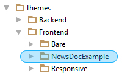
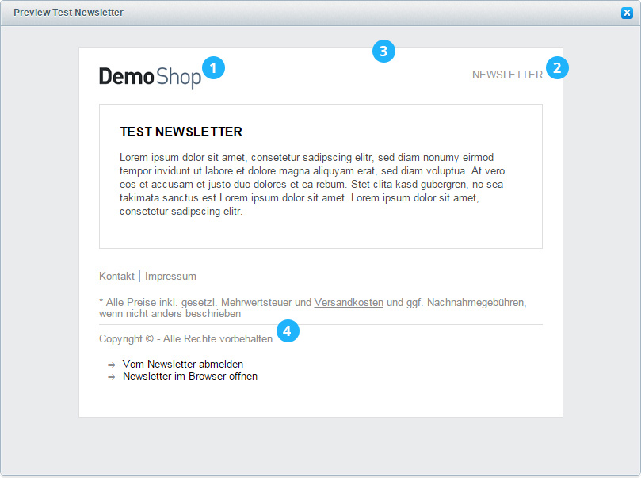
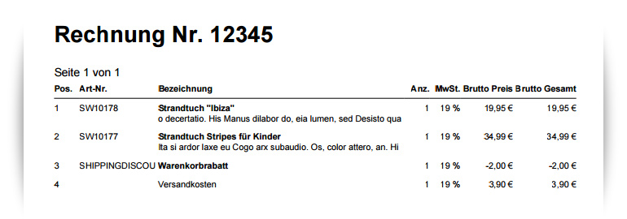

##Table of contents
-   [Introduction](#introduction)
-   [Edit newsletter templates](#edit-newsletter-templates)
    -   [Newsletter directory structure](#newsletter-directory-structure)
    -   [Change the newsletter logo](#change-the-newsletter-logo)
    -   [Change the newsletter headline](#change-the-newsletter-headline)
    -   [Change the newsletters general appearance](#change-the-newsletters-general-appearance)
    -   [Newsletter snippets](#newsletter-snippets)
-   [Edit document templates](#edit-document-templates)
    -   [Documents directory structure](#documents-directory-structure)
    -   [Adding an article description](#adding-an-article-description)

##Introduction

In this guide you will learn how to modify the default appearance of Shopware's newsletter and document templates. 

<div class="alert alert-warning">
<strong>Note:</strong> Before you start modifying your newsletter or document templates please keep in mind that you shouldn't apply any changes to the default <code>Bare</code> theme folder. This can cause issues during the next update process and your changes could be overwritten. You should always include your own newsletter and document modifications within your own Shopware theme. If your don't have a custom Shopware theme you should create one for newsletter and document editing.
</div>

In the following examples we will use a newly created theme called `NewsDocExample`:

 
 
 If you want further information about creating custom themes you can read our [Getting started guide](../getting-started/).

##Edit newsletter templates

In the following steps you will learn how to edit Shopware's default newsletter template. If you want an introduction in  general usage of the newsletter module please have a look at our [newsletter wiki tutorial](http://wiki.shopware.com/Newsletter_detail_933.html).

###Newsletter directory structure
Within the `newsletter` directory you can find all necessary files to edit the template:

```
themes
 ├── Backend
 ├── Frontend
 │   ├── Bare
 │   ├── Responsive
 │   │   ├── documents
 │   │   ├── frontend
 │   │   ├── newsletter
 │   │   │   ├── alt
 │   │   │   ├── container
 │   │   │   └── index
 │   │   └── widgets
```

There are two different types of newsletter templates: A default newsletter template and a merchants template. The `index.tpl` contains the default template and the `indexh.tpl` contains the merchants template.

The newsletter templates are written in HTML containing a table structure to keep compatibility with the most email clients. Because of the email clients the usage of external css files is not possible and the overall appearance is managed by inline styles within the template files.

If the newsletter recipient cannot display HTML emails, Shopware will use the newsletter templates within the `alt` directory. Those contain all important variables to display the newsletter as plain text.



###Change the newsletter logo

To change the **newsletter logo (1)** navigate to the index directory of the Shopware default newsletter theme: `themes/Frontend/Bare/newsletter/index`. Now copy the `header.tpl` file into the matching directory of your created theme: `themes/Frontend/NewsDocExample/newsletter/index`. Within the copied file you can see the following code on line 4:

```

```

If you don't want to display the default shop logo you can simply replace the path with a path to your desired image. In this example we copied our new logo into the `frontend/_public/src/img/logos/` directory of our `NewsDocExample` theme:

```

```

###Change the newsletter headline

In this example we will change the color of the **newsletter headline (2)** in the right top corner. To change the color you can also edit your copied `header.tpl` file from the logo example. You can find the desired code in line 7:
 
```
<span style="color:#999;font-size:13px;">NEWSLETTER</span>
```
 
Now you can modify the color property with another value. In this example we replace the color with a default red:
 
```
<span style="color:#ff0000;font-size:13px;">NEWSLETTER</span>
```

###Change the newsletters general appearance

At first navigate into the default newsletter theme again: `themes/Frontend/Bare/newsletter/index`. Now copy the `index.tpl` file into the matching directory of your created theme: `themes/Frontend/NewsDocExample/newsletter/index`.

If you want to edit the **general appearance of the newsletter (3)** you can e.g. modify the styling of the wrapping newsletter table on line 37:

```
<table align="center" width="560" bgcolor="#ffffff" border="0" cellspacing="25" cellpadding="0" style="color:#8c8c8c; border:1px solid #dfdfdf;font-family:Arial,Helvetica;">
```

In our example we will change the `bgcolor` attribute to a grey tone as well as the border to 2 pixels with a default red color:

```
<table align="center" width="560" bgcolor="#d8d8d8" border="0" cellspacing="25" cellpadding="0" style="color:#8c8c8c; border:2px solid #ff0000;font-family:Arial,Helvetica;">
```

###Change the newsletter footer

To change the **newsletter footer (4)** you copy the `footer.tpl` within the `themes/Frontend/Bare/newsletter/index` directory into your matching theme directory as in the examples before. In our example we will edit the copyright snippet in line 21 and change its color to red:

```
<td style="font-size:13px;text-align:left;color:#ff0000;margin:0;padding:0;padding-top:10px;">
	{s name='NewsletterFooterCopyright'}{/s}
</td>
```

###Newsletter snippets

The newsletter elements like copyright information or the unsubscribe text are snippets which are namespaced in `newsletter/index/footer`. You can edit those snippets with the backend snippet module.

##Edit document templates

In this quick example you will learn how to edit Shopware's default document template for invoices, delivery notes etc. The PDF document creation backend module provides you already with many customization features. If you'd like more information about the general usage please have a look at our [PDF document creation wiki tutorial](http://wiki.shopware.com/PDF-Belegerstellung_detail_1086.html).

### Documents directory structure

You can find the document templates within the documents folder of the `Bare` theme.

```
themes
 ├── Backend
 ├── Frontend
 │   ├── Bare
 │   ├── Responsive
 │   │   ├── documents
 │   │   │   ├── index.tpl
 │   │   │   ├── index_gs.tpl
 │   │   │   ├── index_ls.tpl
 │   │   │   └── index_sr.tpl
 │   │   ├── frontend
 │   │   ├── newsletter
 │   │   └── widgets
```

There are four types of document templates:

-   Invoice template: `index.tpl`
-   Delivery note template: `index_ls.tpl`
-   Credit template: `index_gs.tpl`
-   Cancellation invoice template: `index_sr.tpl`

### Adding an article description

In our example we want to add a short article description to the invoice template. The default invoice template comes only with the article names without descriptions. To edit the `index.tpl` (invoice template) you create a new `index.tpl` within your own theme `NewsDocExample`. Now you can extend from the original invoice template just like in other Shopware templates:

```
{extends file='parent:documents/index.tpl'}
```
Within the extended `index.tpl` you can override the `document_index_table_name` block to add the product description. In our example we have added a truncating with 70 characters to keep the width of the table layout:

```
{$position.meta.description_long|truncate:70:""}
```
The `$position` variable provides you with even more article variables. If you need more variables you can read our wiki tutorial about [additional variables in PDF document templates](http://wiki.shopware.com/pdf-Belegerstellung-Zus%C3%A4tzliche-Variablen_detail_1220.html).

You can also set the article name to `<strong>` for better appearance:
```
<strong>{s name="DocumentIndexPositionNameDefault"}{$position.name|nl2br}{/s}</strong>
```

Because of the table layout we also have to copy a few lines from the original `index.tpl`:

```
{extends file='parent:documents/index.tpl'}

{block name="document_index_table_name"}
	<td align="left" width="48%" valign="top">
		{if $position.name == 'Versandkosten'}
			{s name="DocumentIndexPositionNameShippingCosts"}{$position.name}{/s}
		{else}
			<strong>{s name="DocumentIndexPositionNameDefault"}{$position.name|nl2br}{/s}</strong><br/>
			{$position.meta.description_long|truncate:70:""}
		{/if}
	</td>
{/block}
```

#### Result:
