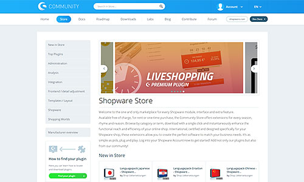
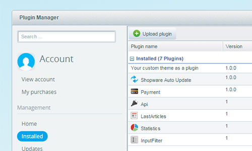

##Introduction
This guide explains how to prepare your custom themes, wrap them into plugins that can be installed with the Shopware plugin manager and make them ready to be downloaded or purchased inside the [shopware community store](http://store.shopware.com/en/).

To publish your plugins in the shopware community store, you need to register your own developer prefix in your [Shopware account](https://account.shopware.com). The result of the theme that was created in the [getting-started](../getting-started/) guide will be used as an example of this tutorial.



##Plugin structure
The plugin directory has to have a specific structure in order to work inside shopware 5. The plugin folder name has to match the Shopware plugin naming pattern, which consists of the `developer prefix` and the `plugin name`. In this example the plugin directory name is "SwagTutorialTheme" (Swag as the prefix for shopware AG, TutorialTheme as the plugin name).

```
[developer prefix][plugin name]
```

Themes in the Shopware community store have to be wrapped inside plugins in order to be installable with the plugin manager. The plugin requires a `Bootstrap.php` file in the root directory and the custom theme, that was previously created. It has to be located inside the `Themes/Frontend` folder (just as it would be inside the normal Shopware installation). 

**Attention: the folder and file names are case sensitive.**


#####Plugin directory
```
SwagTutorialTheme
 ├── Themes
 │    ├──Frontend
 │    │   ├──TutorialTheme
 │    │   │    ├── preview.png
 │    │   │    ├── Theme.php
 │    │   │    └── frontend
 └── Bootstrap.php
```

##Creating the plugin

The only requirements the `Bootstrap.php` file has in this case, are the plugin label (name that is displayed in the plugin/theme manager later on) and the version number. So with that in mind, you would create the file and add the 2 required functions to it. Because the `TutorialTheme` folder is located inside the `Themes/Frontend`, the plugin automatically detects the content.

#####Bootstrap.php
```
<?php
class Shopware_Plugins_Frontend_SwagTutorialTheme_Bootstrap extends Shopware_Components_Plugin_Bootstrap
{
    /**Returns a marketing friendly name of the plugin.*/
    public function getLabel()
    {
        return 'Your custom theme as a plugin';
    }

    /**Returns the version of the plugin.*/
    public function getVersion()
    {
        return '1.0.0';
    }
}
```

The plugin should now be displayed inside the plugin manager and just has to be installed by the user to be able to select the theme in the theme manager along with all other themes. If this is the case, the plugin is ready to be published in the Shopware community store. 


##Result
The example plugin as download:

+   [Final store-ready plugin - Download](SwagTutorialTheme.zip)