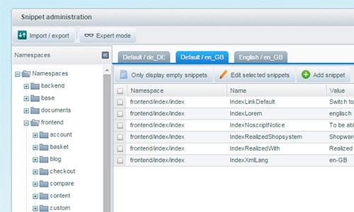

## Introduction
Snippets are a extremely easy and useful way to translate parts of text in the Shopware storefront. By using the snippets you are able to determine the content of a specific text part of the theme individual for every shop. The part you would like to edit has to be wrapped inside a snippet tag. Every snippet is editable in the Shopware 5 backend by using the snippet administration.

##Creating Snippets
Snippets can be added inside the template files of Shopware using the Smarty snippet tag `{s}`. The snippet tag requires a unique name, which is usually named after the path of the usage.
The snippets are saved by the following principle:

+   Template is rendered
+   Snippet is saved to the database when not already existing
+   If it exists the snippet is loaded from the database.

After the snippet is saved into the database for the first time, everytime the snippet is called, it is loaded from the database and the value inside the template files will be ignored. The snippets can now be translated inside the snippet administration in the Shopware backend.

Path: *(Configuration &rarr; Snippets)*

```
{s name="frontend/checkout/cart/separate_dispatch"}example text{/s}
```

Snippets are ordered by namespaces, which are automatically set depending on the file the snippet is located in when saved to the database. If you want to use the same snippet in different files, you will have to call the namespace of the original file by using the `namespace` attribute.

#####For a single snippet
```
{s name="frontend/checkout/cart/separate_dispatch" namespace="frontend/listing/box_article"}example text{/s}
```

#####For the whole file
```
{namespace name="frontend/listing/box_article"}
```

You also have the ability to save a little bit of code inside your snippets.

```
{s name="frontend/checkout/cart/separate_dispatch"}<strong>bold example text</strong>{/s}
```

##Backend snippet administration


The snippet administration allows you to translate the existing snippets right in the Shopware 5 backend. You have the ability to add content to the snippets individually for every existing subshop. The snippets are ordered by namespaces, which represent the location of the file the snippet is used in. The namespaces allow snippets to have with the same name, but in different namespaces.

##Adding default snippets to a theme
You have the ability to add snippets to your custom themes by adding the required folder structure and files to the directory. 

Shopware 5 saves the default snippets inside `.ini` files. To add default snippets to your theme you will have to add a `_private` folder to your theme and create a `snippets` subfolder, where the `.ini` files will be saved.

```
ThemeFolder
    _private
        snippets
            frontend
                listing
                    box_article.ini
```