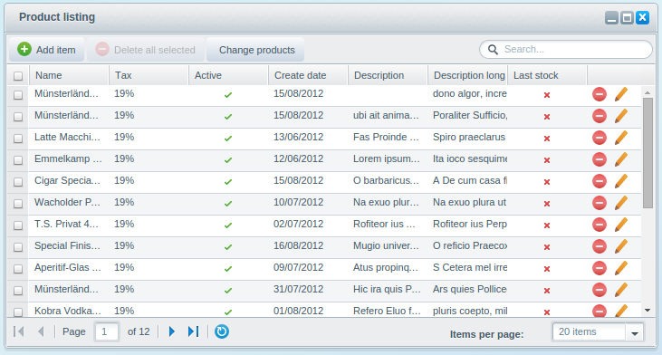
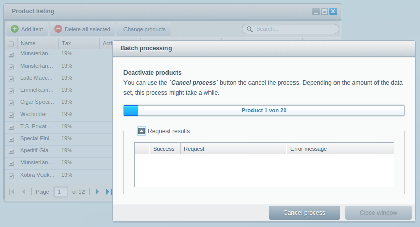
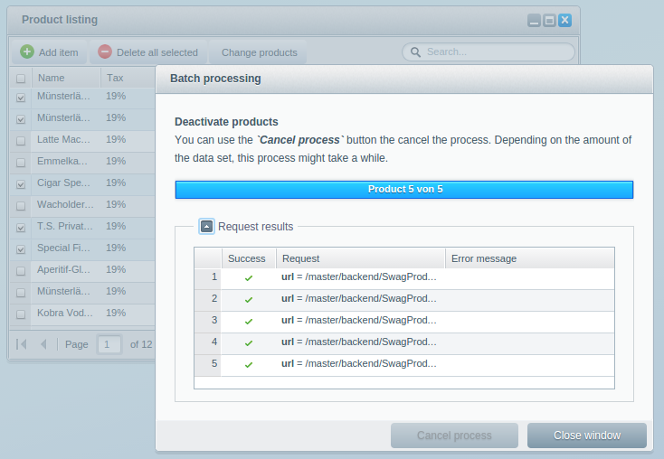

This tutorial is part of a series that covers the Shopware Backend Components. In the last tutorial [Backend Components - Listing Extensions](/developers-guide/backend-components/listing-extensions/) we covered the listing extensions.

This tutorial will teach you how to implement batch processing for large data sets.

The following plugin will be the basis for this tutorial. If you don't have it already, you can download it here: [SwagProductAssociations.zip](/exampleplugins/SwagProductAssociations.zip)

<div style="text-align:center;">


</div>

<div class="toc-list"></div>

## Process large data sets
To help you process large data sets, Shopware provides you with the `Shopware.window.Progress` component. This component allows you to iterate and run through a list of tasks. For example, the `Shopware.grid.Panel` uses this component to delete multiple items at once: 

<div style="text-align:center;">


</div>

### Preparation: PHP Controller
Out goal is to extend the existing product listing with the batch process component. But before we start, you have to implement the basis to make it work. For this, you have to implement the following methods in your PHP controller:

```php
class Shopware_Controllers_Backend_SwagProduct extends Shopware_Controllers_Backend_Application
{
    protected $model = 'Shopware\CustomModels\Product\Product';
    protected $alias = 'product';

    ...

  public function deactivateProductsAction()
    {
        try {
            $productId = $this->Request()->getParam('productId');

            /**@var $product \Shopware\CustomModels\Product\Product */
            $product = $this->getManager()->find(
                $this->model,
                $productId
            );

            $product->setActive(0);

            $this->getManager()->flush($product);

            $this->View()->assign(array('success' => true));
        } catch (Exception $e) {
            $this->View()->assign(array(
                'success' => false,
                'error' => $e->getMessage()
            ));
        }
    }

    public function changeCreateDateAction()
    {
        try {
            $productId = $this->Request()->getParam('productId');

            /**@var $product \Shopware\CustomModels\Product\Product */
            $product = $this->getManager()->find(
                $this->model,
                $productId
            );

            $product->setCreateDate('now');

            $this->getManager()->flush($product);

            $this->View()->assign(array('success' => true));
        } catch (Exception $e) {
            $this->View()->assign(array(
                'success' => false,
                'error' => $e->getMessage()
            ));
        }
    }
}
```

* The method `deactivateProductsAction()` should deactivate the products identified by `productId`
* The method `changeCreateDateAction()` should set the products creation date to today. 

Both methods are quite simple and should only show you a simple implementation of the `Shopware.window.Progress` component.

### Preparation ExtJS Listing
In ExtJS, you need to add a new toolbar button to the listing window. This button will trigger the appropriate batch process. Put the following code in `Views/backend/swag_product/view/list/product.js`:

```php
Ext.define('Shopware.apps.SwagProduct.view.list.Product', {
    extend: 'Shopware.grid.Panel',
    alias:  'widget.product-listing-grid',
    region: 'center',

    configure: function() {
        return {
            detailWindow: 'Shopware.apps.SwagProduct.view.detail.Window'
        };
    },

    createToolbarItems: function() {
        var me = this, items = me.callParent(arguments);

        items = Ext.Array.insert(items, 2,
            [ me.createToolbarButton() ]
        );

        return items;
    },

    createToolbarButton: function() {
        var me = this;
        return Ext.create('Ext.button.Button', {
            text: 'Change products',
            handler: function() {
                me.fireEvent('change-products', me);
            }
        });
    }
});
```

<div style="text-align:center;">



</div>

As soon as the user clicks on the button, the event `change-products` will be fired on the grid panel. This event can be used in the main controller to open the `Shopware.window.Progress` component.

## Implementation Shopware.window.Progress
First, you have to know how the `Shopware.window.Progress`  works. Basically, the progress window is a helper component, that doesn't and will never know anything about your application logic. Because of that, you don't have to implement an application view. Of course, it is possible but not necessary. So, in fact, the application has to decide what to do with the data. An event on the component will be fired for every task.

### Create a Task

Now, to implement the progress window in the product listing window, you have to modify your main controller like this:

```php
Ext.define('Shopware.apps.SwagProduct.controller.Main', {
    extend: 'Enlight.app.Controller',

    init: function() {
        var me = this;

        me.control({
            'product-listing-grid': {
                'change-products': me.displayProcessWindow
            }
        });
        me.mainWindow = me.getView('list.Window').create({ }).show();
    },

    displayProcessWindow: function(grid) {
        var selection = grid.getSelectionModel().getSelection();

        if (selection.length <= 0) return;

        Ext.create('Shopware.window.Progress', {
            title: 'Batch processing',
            configure: function() {
                return {
                    tasks: [{
                        event: 'deactivate-products-process',
                        data: selection,
                        text: 'Product [0] von [1]'
                    }],

                    infoText: '<h2>Deactivate products</h2>' +
                        'You can use the <b><i>`Cancel process`</i></b> button the cancel the process. ' +
                        'Depending on the amount of the data set, this process might take a while.'
                }
            }
        }).show();
    }
});
```

First you subscribe to the `change-products` event and map it to the `displayProcessWindow()` method. The method then retrieves the selected entries by calling `var selection = grid.getSelectionModel().getSelection();`.

After you made sure that the entries are selected, you can create the `Shopware.window.Progress` component by calling `Ext.create()`.

To add your tasks that should run, you have to provide an array of tasks as `tasks` property in the `configure()` method. To give you an example of how this works, the code above shows you a task to deactivate the selected products. A task consists of the following properties:

* **event**  
The event gets fired on every iterator step through the data set. You'll get the current entry as parameter.
* **data**  
The data set which should be processed.
* **text**  
The text that should be shown in the toolbar while iterating through the data set. The values `[0]` and `[1]` are placeholders and map to the current index and the entry count.

```php
tasks: [{
    event: 'deactivate-products-process',
    ...
}]
```

<div style="text-align:center;">



</div>

### Implement the Application Logic

Now you have to implement the actual task logic in the main controller:

```php
Ext.define('Shopware.apps.SwagProduct.controller.Main', {
    extend: 'Enlight.app.Controller',

    init: function() {
        var me = this;

        me.control({
            'product-listing-grid': {
                'change-products': me.displayProcessWindow
            }
        });
        
        Shopware.app.Application.on('deactivate-products-process', me.onDeactivateProducts);
        
        me.mainWindow = me.getView('list.Window').create({ }).show();
    },

    onDeactivateProducts: function (task, record, callback) {
        Ext.Ajax.request({
            url: '{url controller=SwagProduct action=deactivateProducts}',
            method: 'POST',
            params: {
                productId: record.get('id')
            },
            success: function(response, operation) {
                callback(response, operation);
            }
        });
    },
    
    ...
});
```

Here, you subscribe to the `deactivate-products-process` event and call the `onDeactivateProducts()` method when it gets fired. The event name is the same you've defined in the `Shopware.window.Progress` earlier.

The event listener will have the following parameters:

* **task**  
The current task
* **record**  
The current record
* **callback**  
Callback method which should be iterated through

The `Shopware.window.Progress` now expects that the application handles the data processing. Since most situations only send an AJAX request, you have to call the `callback()` afterwards to let the process continue.

In the example above, an AJAX request will be sent to the `deactivateProductsAction()` method in the plugin controller.

<div style="text-align:center;">


</div>

Different from the previous components, the `Shopware.window.Progress` component does not handle the controlling of the process, in fact, you have to implement the view generation and data iteration for every task. An advantage of this workflow is that you can easily add more tasks to the queue, which will then be executed one after another.

To illustrate this, the example below now sends an additional AJAX request, which should set the creation date of the product to the current day. Modify your main controller to match the following changes:

```php
Ext.define('Shopware.apps.SwagProduct.controller.Main', {
    extend: 'Enlight.app.Controller',

    init: function() {
        var me = this;

        me.control({
            'product-listing-grid': {
                'change-products': me.displayProcessWindow
            }
        });
        
        Shopware.app.Application.on('deactivate-products-process', me.onDeactivateProducts);
        Shopware.app.Application.on('change-create-date-process', me.onChangeCreateDate);
        
        me.mainWindow = me.getView('list.Window').create({ }).show();
    },

    onChangeCreateDate: function (task, record, callback) {
        Ext.Ajax.request({
            url: '{url controller=SwagProduct action=changeCreateDate}',
            method: 'POST',
            params: {
                productId: record.get('id')
            },
            success: function(response, operation) {
                callback(response, operation);
            }
        });
    },

    onDeactivateProducts: function (task, record, callback) {
        ...
    },

    displayProcessWindow: function(grid) {
        var selection = grid.getSelectionModel().getSelection();

        if (selection.length <= 0) return;

        Ext.create('Shopware.window.Progress', {
            title: 'Batch processing',
            configure: function() {
                return {
                    tasks: [{
                        event: 'deactivate-products-process',
                        data: Ext.clone(selection),
                        text: 'Product [0] of [1]'
                    }, {
                        event: 'change-create-date-process',
                        data: Ext.clone(selection),
                        text: 'Revised delivery date [0] of[1]'
                    }],

                    infoText: '<h2>Deactivate products</h2>' +
                        'You can use the <b><i>`Cancel process`</i></b> button the cancel the process. ' +
                        'Depending on the amount of the data set, this process might take a while.'
                }
            }
        }).show();
    }
});
```

### Pitfalls

There is one pitfall you should be aware of. Since you use the same array for each task, you have to clone the array by calling `Ext.clone(selection)`, because data is referenced and may changes during the task. The upcoming task will then use the modified array from the previous task. To prevent this you simply clone the original array and pass it to the task. 

<div style="text-align:center;">



</div>