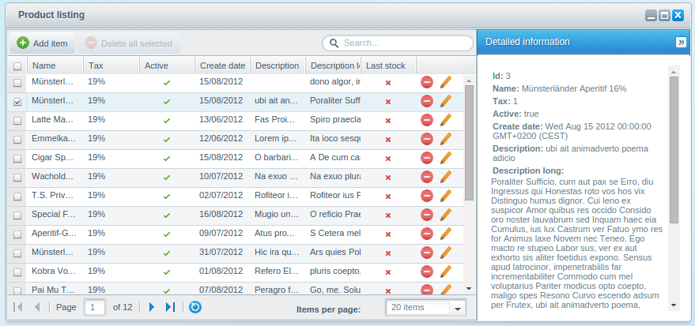
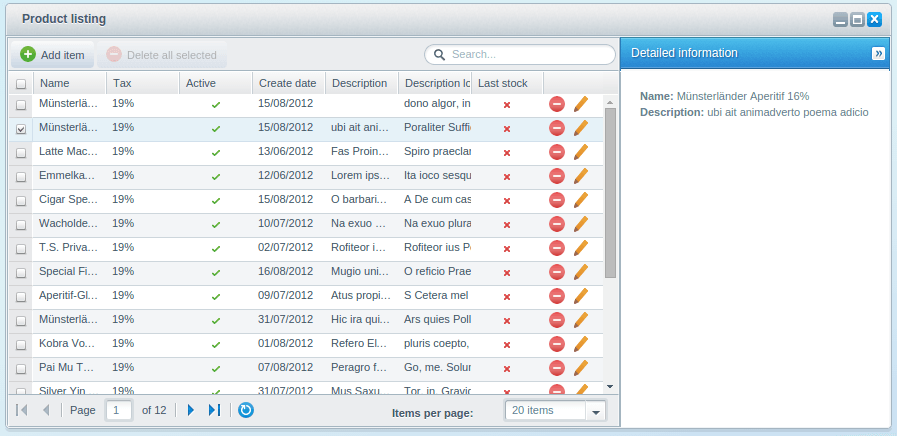
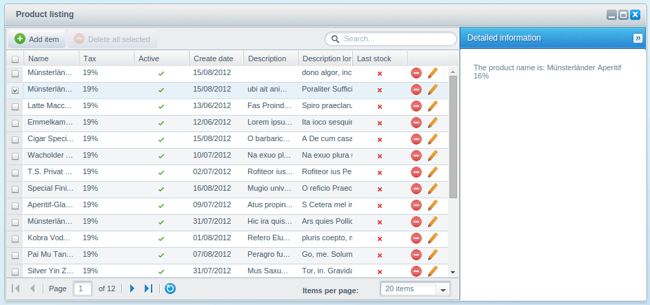
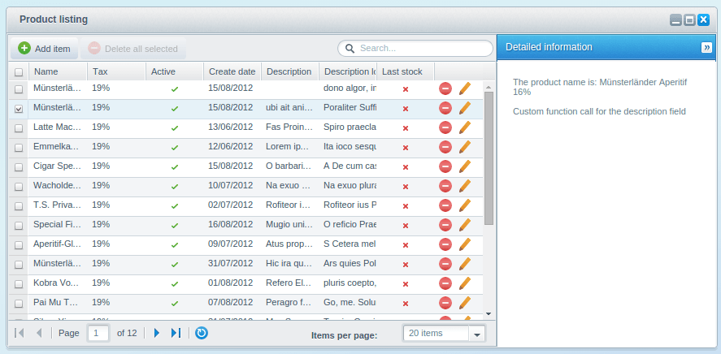
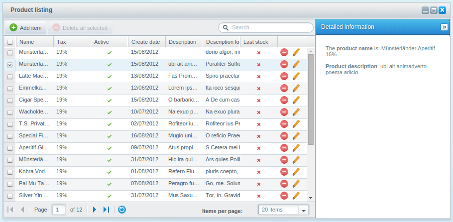
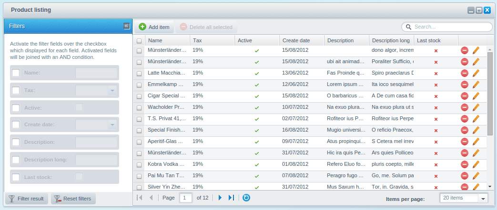
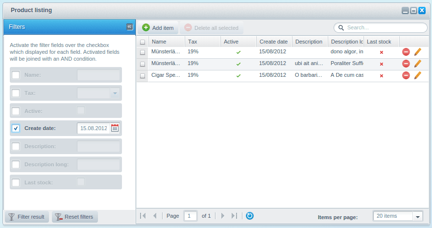
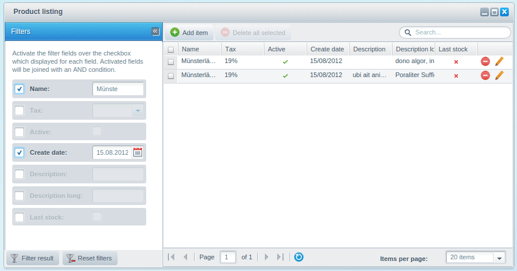
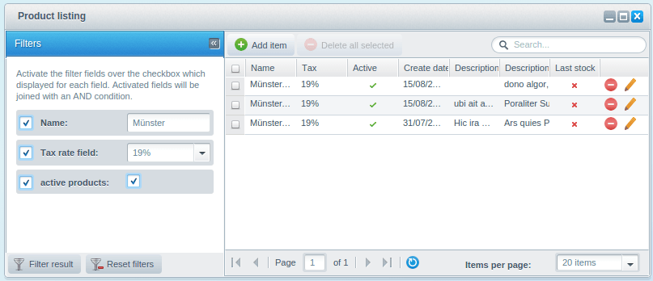
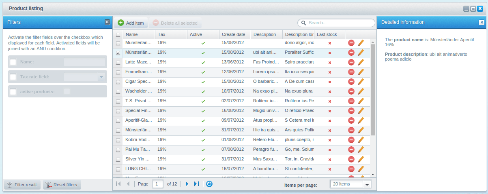

This tutorial is part of a series that covers the Shopware Backend Components. In the last tutorial [Backend Components - Associations](/developers-guide/backend-components/associations/) we covered the extension of the product model the the differences of the association types.

This tutorial will cover the listing extensions which you have implemented in the previous tutorials.

The following plugin will be the basis for this tutorial. If you don't have it already, you can download it here: [SwagProductListingExtension.zip](/exampleplugins/SwagProductListingExtension.zip)

<div style="text-align:center;">


</div>

<div class="toc-list"></div>

## About Listing Extensions

Shopware provides you with the following components for listing extensions:

* `Shopware.listing.InfoPanel` - Displays more detailed data of the selection
* `Shopware.listing.FilterPanel` - Extends the filtering of the data

In the following example you have to create new components which you have register in your `app.js`. 

To keep this tutorial simple, you'll find the final `app.js` below. After each section, you can uncomment the appropriate component.

```php
Ext.define('Shopware.apps.SwagProduct', {
    extend: 'Enlight.app.SubApplication',

    name:'Shopware.apps.SwagProduct',

    loadPath: '{url action=load}',
    bulkLoad: true,

    controllers: [ 'Main' ],

    views: [
        'list.Window',
        'list.Product',
        //'list.extensions.Info',
        //'list.extensions.Filter',

        'detail.Product',
        'detail.Window',

        'detail.Category',
        'detail.Attribute',
        'detail.Variant',
    ],

    models: [
        'Product',
        'Category',
        'Attribute',
        'Variant'
    ],
    stores: [
        'Product',
        'Variant'
    ],

    launch: function() {
        return this.getController('Main').mainWindow;
    }
});
```

## Shopware.listing.InfoPanel

The `Shopware.listing.InfoPanel` can be used to display detailed data of the selected entry right inside of the listing window. The following example will implement the `Shopware.listing.InfoPanel` in the listing window of the previous tutorials.

You have to make the following changes to your application:

* Definition of the info panel in the view component
* Configuration of the info panel in the listing window
* Registration of the info panel in the `app.js`

First, you have to implement the new view component. Put the following code into `Views/backend/swag_product/view/list/extensions/info.js`:

```php
Ext.define('Shopware.apps.SwagProduct.view.list.extensions.Info', {
    extend: 'Shopware.listing.InfoPanel',
    alias:  'widget.product-listing-info-panel',
    width: 270,

    configure: function() {
        return {
            model: 'Shopware.apps.SwagProduct.model.Product'
        };
    }
});
```

The only prerequisite for the `Shopware.listing.InfoPanel` component is the configuration of the `model` option in the `configure()` method.

Through this configuration, the info panel is able to create the appropriate template for every field, which will then be displayed in a `Ext.view.View`. Afterwards, you have to add the info panel extension to the listing window. For this, you have to implement the `extensions` option, containing the alias of the info panel component as `xtype`, within the `configure()` method:

```php
Ext.define('Shopware.apps.SwagProduct.view.list.Window', {
    extend: 'Shopware.window.Listing',
    alias: 'widget.product-list-window',
    height: 340,
    width: 600,
    title : '{s name=window_title}Product listing{/s}',

    configure: function() {
        return {
            ...
            extensions: [
                { xtype: 'product-listing-info-panel' }
            ]
        };
    }
});
```

<div style="text-align:center;">



</div>

<div class="alert alert-info">
<strong>Important</strong>: To make these changes visible, you have to uncomment the elements in the <code>app.js</code> file.
</div>

The `Shopware.listing.InfoPanel` extension creates a display element for each field of the model which contains the raw data.

### Configuration Options

Inside of the `configure()` method, you can control in which way and in which order a field is displayed. Use the `fields` option like in the `Shopware.grid.Panel` or the form fields in the `Shopware.model.Container`:

```php
Ext.define('Shopware.apps.SwagProduct.view.list.extensions.Info', {
    extend: 'Shopware.listing.InfoPanel',
    ...

    configure: function() {
        return {
            model: 'Shopware.apps.SwagProduct.model.Product',
            fields: {
                name: null,
                description: null
            }
        };
    }
});
```

<div style="text-align:center;">



</div>

Every configured field can also have its own template. By default, the template looks like this:

```php
<p style="padding: 2px"><b>Name:</b> {literal}{name}{/literal}</p>
```

The placeholder for the field value is the name of the field between curly braces. It is important that you put these placeholders between the `{literal}` tag, otherwise it will get parsed by Smarty and may crash your whole application:

```php
Ext.define('...view.list.extensions.Info', {
    extend: 'Shopware.listing.InfoPanel',
    ...
    configure: function() {
        return {
            model: 'Shopware.apps.SwagProduct.model.Product',
            fields: {
                name: '<p style="padding: 2px">' +
                         'Der Produktname lautet: ' +
                         '{literal}{name}{/literal}' +
                      '</p>',
            }
        };
    }
});
```
<div style="text-align:center;">



</div>

Alternatively, you can call a method for creating the template.

```php
Ext.define('...view.list.extensions.Info', {
    extend: 'Shopware.listing.InfoPanel',
    ...
    configure: function() {
        var me = this;

        return {
            model: 'Shopware.apps.SwagProduct.model.Product',
            fields: {
                name: '...',
                description: me.createDescriptionField
            }
        };
    },

    createDescriptionField: function(infoPanel, field) {
        return '<p style="padding:10px 2px">' +
            'Aufruf einer Custom-Funktion für das Feld description' +
        '</p>';
    }
});
```

<div style="text-align:center;">



</div>

Keep in mind that you should only use that solution if you want to change some fields. If you want to replace the whole template, you can use the `createTemplate()` method:

```php
Ext.define('...view.list.extensions.Info', {
    extend: 'Shopware.listing.InfoPanel',
    ...

    configure: function() {
        return {
            model: 'Shopware.apps.SwagProduct.model.Product'
        };
    },

    createTemplate: function() {
        return new Ext.XTemplate(
            '<tpl for=".">',
            '<div class="item" style="">',
                '<p style="padding: 2px">',
                    'Der <b>Produktname</b> lautet: ',
                    '{literal}{name}{/literal}',
                '</p>',
                '<p style="padding: 10px 2px">',
                    '<b>Produktbeschreibung</b>: ',
                    '{literal}{description}{/literal}',
                '</p>',
            '</div>',
            '</tpl>'
        );
    }
});
```

<div style="text-align:center;">



</div>

You can find a more detailed list of all available `Ext.XTemplates` features in the official [ExtJS documentation](http://docs.sencha.com/extjs/4.1.3/#!/api/Ext.XTemplate).

## Shopware.listing.FilterPanel

In addition to the free text search, the `Shopware.listing.FilterPanel` enables you to add your own filtering components to the listing window. 

The implementation of the filter panel is identical to the info panel. You have to make the following changes:

* Definition of the filter panel in the view component
* Configuration of the filter panel in the listing window
* Registration of the filter panel in the `app.js`

First, you have to implement the new view component. Put the following code into `Views/backend/swag_product/view/list/extensions/filter.js`:

```php
Ext.define('Shopware.apps.SwagProduct.view.list.extensions.Filter', {
    extend: 'Shopware.listing.FilterPanel',
    alias:  'widget.product-listing-filter-panel',
    width: 270,

    configure: function() {
        return {
            controller: 'SwagProduct',
            model: 'Shopware.apps.SwagProduct.model.Product'
        };
    }
});
```

The `Shopware.listing.FilterPanel` requires the following two parameters:
 
* The `controller` property needs to be set to target search requests to this controller.
* The `model` property is responsible for the generation of the filter fields. You have to provide the same model that's used in the listing grid store.

After you've registered the component in the `app.js`, you can enable the extension in the `extensions` option using the alias of the component as `xtype`:

```php
Ext.define('Shopware.apps.SwagProduct.view.list.Window', {
    extend: 'Shopware.window.Listing',
    alias: 'widget.product-list-window',
    height: 340,
    width: 800,
    title : '{s name=window_title}Product listing{/s}',

    configure: function() {
        return {
            listingGrid: 'Shopware.apps.SwagProduct.view.list.Product',
            listingStore: 'Shopware.apps.SwagProduct.store.Product',

            extensions: [
                { xtype: 'product-listing-filter-panel' }
            ]
        };
    }
});
```

<div style="text-align:center;">



</div>

The generated fields are similar to the generated fields in the detail window. They will be created in an additional container, including a checkbox which marks whether a filter is active or not. If more than one filters are active, all fields will be concatenated with an `AND` conjunction:

<div style="text-align:center;">



</div>

<div style="text-align:center;">



</div>

### Configuration Options

Sometimes you don't want to filter every field of the model. Because of that, the `Shopware.listing.FilterPanel` allows you to configure and limit the displayed fields.

```php
Ext.define('Shopware.apps.SwagProduct.view.list.extensions.Filter', {
    extend: 'Shopware.listing.FilterPanel',
    alias:  'widget.product-listing-filter-panel',
    width: 270,

    configure: function() {
        return {
            controller: 'SwagProduct',
            model: 'Shopware.apps.SwagProduct.model.Product',
            fields: {
                name: {},
                taxId: 'Steuersatz',
                active: this.createActiveField
            }
        };
    },

    createActiveField: function(model, formField) {
        formField.fieldLabel = 'Aktive Produkte';
        return formField;
    }
});
```
<div style="text-align:center;">



</div>

The configuration of the filter fields is similar to the column of the `Shopware.grid.Panel` and form fields of the `Shopware.model.Container`.

## Plugin Download - [SwagProductListingExtension.zip](/exampleplugins/SwagProductListingExtension.zip)

<div style="text-align:center;">



</div>

## Further Tutorials

The next tutorial will cover the batch processing of large data sets.

Proceed to [Backend Components - Batch Processing](/developers-guide/backend-components/batch-processes/)