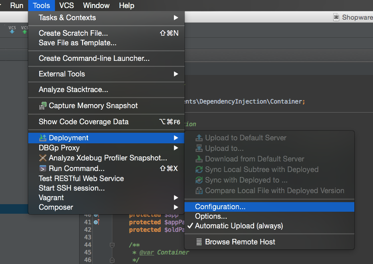
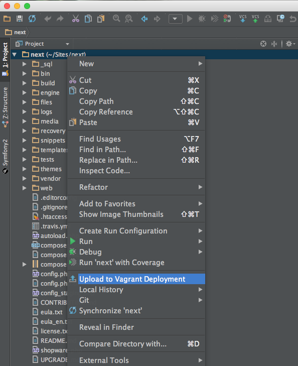

## Vagrant Shopware Box

We published a [Vagrant Setup](https://github.com/shopwareLabs/shopware-vagrant) that provides you with a basic Ubuntu 14.04 that contains all the bits and pieces needed to develop with Shopware.
It contains the Apache Web server, MySQL Server as well as all required tools, like `ant`, `curl` and `git`.

Please note that Vagrant setup does not contain a Shopware installation. The installation has to be done manually.

### Installation

Download the required software:

 - [Virtualbox](https://www.virtualbox.org/wiki/Downloads)
 - [Vagrant](https://www.vagrantup.com/downloads)

The provision is done by [Ansible](http://www.ansibleworks.com/docs/) directly on the created vm.

Clone the repository to your local machine.

	$ git clone https://github.com/shopwareLabs/shopware-vagrant
    $ cd shopware-vagrant

Boot up your Vagrant virtual machine:

    $ cd vagrant
    $ vagrant up

The first boot may take a while, so feel free to get a cup of coffee.

Your machine will be available at [http://33.33.33.10/](http://33.33.33.10/).
All required tools like the LAMP stack are already installed.

- PHPMyAdmin: [http://33.33.33.10/phpmyadmin](http://33.33.33.10/phpmyadmin)
- MySQL user: `root`, password: `shopware`

### SSH Commands

The SSH username is `vagrant`, the password: `vagrant`.

To SSH into the created VM:

    $ vagrant ssh

If you use Putty, the ssh configuration can be obtained via:

    $ vagrant ssh-config

### Deploy with PhpStorm

To deploy a locally installed project to the Vagrant server, we created an auto deployment in our favorite IDE, PhpStorm

Please clone the shopware github verison onto your local machine.

`git clone https://github.com/shopware/shopware.git`

#### Step 1
Open your Shopware project in PhpStorm.
Choose in your toolbar Tools -> Deployment -> Configuration

### Step 2
Now we add our new Vagrant machine as deployment target.

Choose a unique name and the "SFTP" type.

Fill in all required fields.

* SFTP host: `127.0.0.1`
* Port: `2222`
* Root Path: `/home/vagrant/www`
* User name: `vagrant`
* Password: `vagrant`
* Save Password: `yes`
* Web server root URL: `http://33.33.33.10/`

Now press OK to save your settings.
If you configured your deployment machine successfully, you will be now asked to add the RSA key to your known hosts. Press *Yes*

After pressing yes you get the success message.

### Step 3
After adding our deploy machine we create a mapping between local files and remote files.
Switch to the Mappings folder and press the "..." near `Deployment path`.
Choose `/home/vagrant/www/shopware`. If the shopware folder doesn't exists, create it here with right click.

Now press OK and close all deployment windows, so you are back in your default IDE view.

Right click on your document root folder and click on `Upload to Vagrant Deployment`

### Automatic Upload

You should enable the automatic upload function so you don't have to hit the upload button every time you change a file: `Tools > Deployment > Automatic Upload`.

### PhpStorm Shopware Plugin

For a full integration of Shopware in PhpStorm please follow this [Guide](https://confluence.jetbrains.com/display/PhpStorm/Shopware+development+with+PhpStorm).

## Build Shopware

Now that we uploaded Shopware onto the Vagrant box, we have to configure and install the development edition of Shopware.

### Step 1
Join your vagrant machine via ssh using the `vagrant ssh` command

    $ vagrant ssh
    $ cd /home/vagrant/www/shopware/build
  
### Step 2
Configure your build properties using

    $ ant configure
  
Input fields:

- db-host: `localhost`
- db name: `shopware`
- db username: `root`
- db password: `shopware`
- app host: `33.33.33.10`
- app path: `/shopware`

After you get the `"BUILD SUCCESSFUL"` message you can run the full build command.

    $ ant build-unit

### Step 3

Download the test images and extract them:

    $ cd ..
    $ wget -O test_images.zip http://releases.s3.shopware.com/test_images.zip
    $ unzip test_images.zip

  
After the build is complete you can view your full installed Shopware under:

[http://33.33.33.10/shopware](http://33.33.33.10/shopware)

### Step 4
Open the backend by adding a `/backend` to your default Shopware installation.

[http://33.33.33.10/shopware/backend](http://33.33.33.10/shopware/backend)

* Default user: `demo`
* Default pass: `demo`
