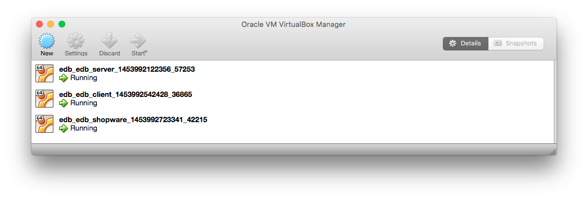
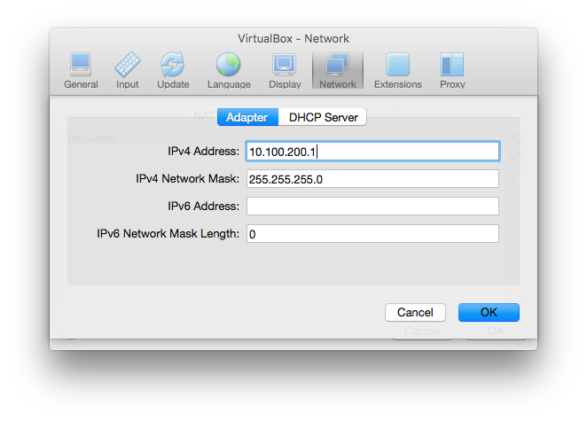
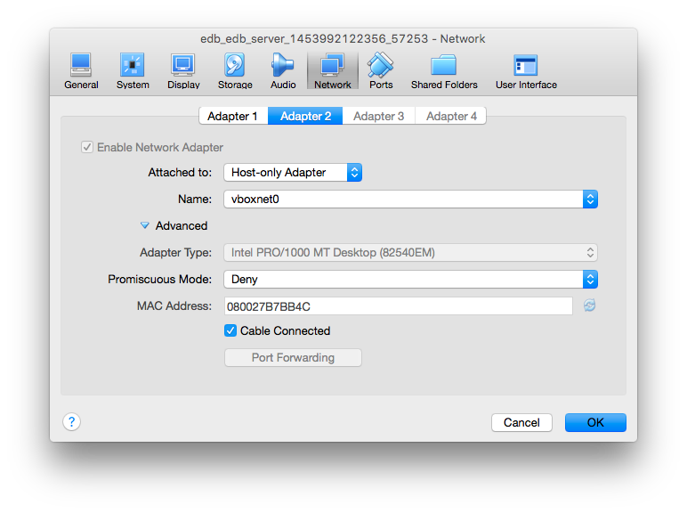
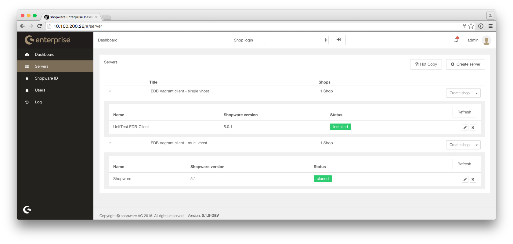
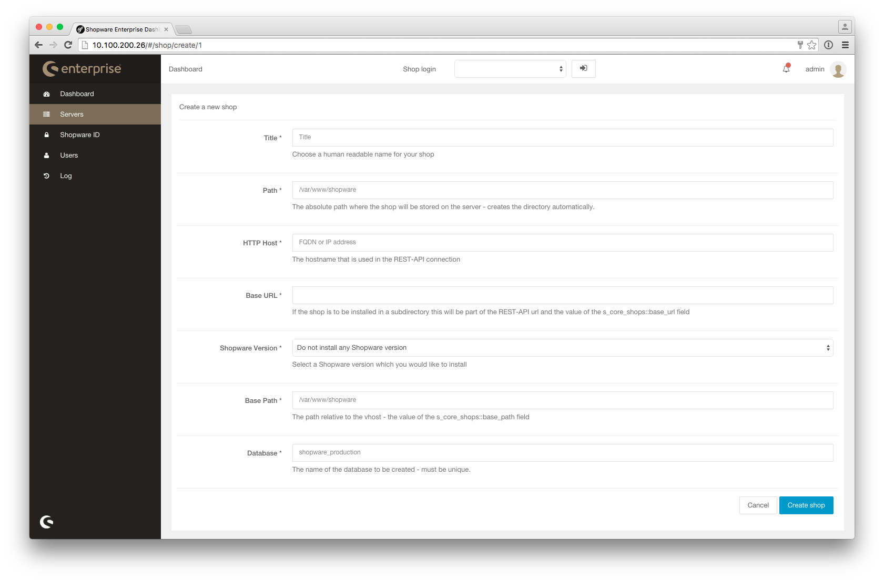
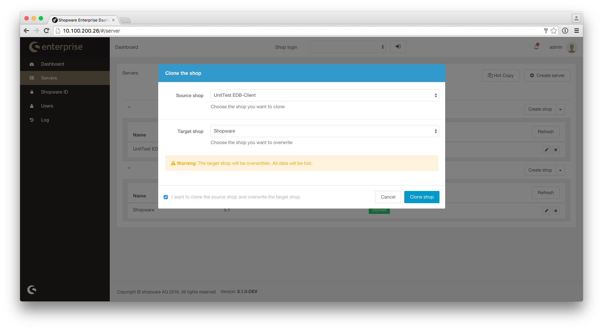
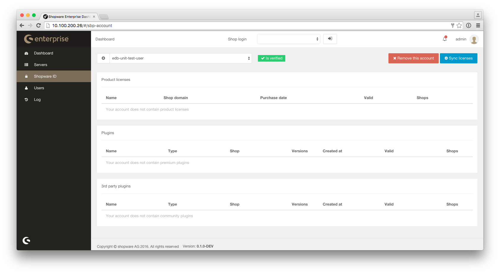
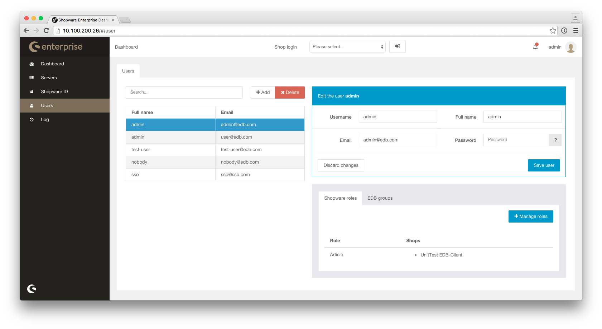
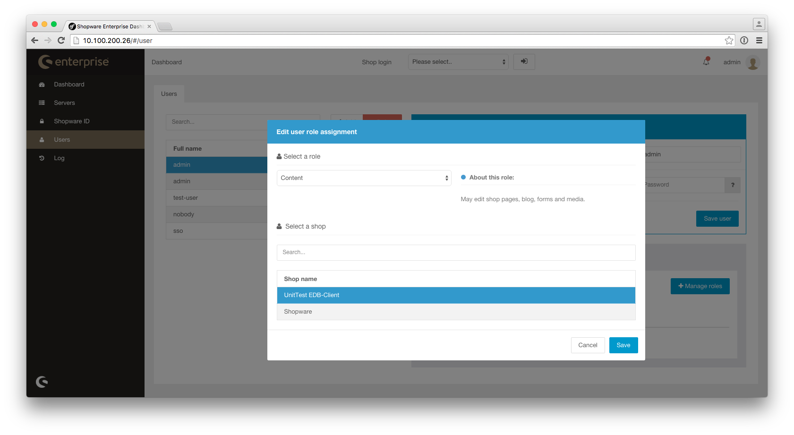
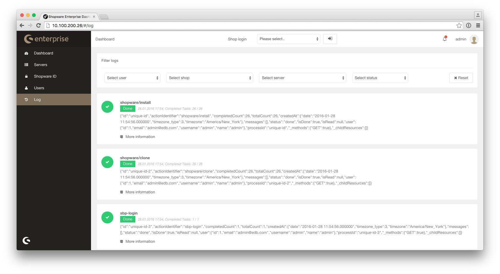

This guide will give you an overview of the Shopware Enterprise Dashboard (EDB)

## Installation (beta phase) and access

During the beta phase, the EDB will be distributed as a [Virtualbox](https://www.virtualbox.org/) package file. After installing Virtualbox, you can check [this page](https://docs.oracle.com/cd/E26217_01/E26796/html/qs-import-vm.html) to learn how you can import the provided package file.

After the importing process is finished, you should have 3 new virtual machines in Virtualbox:

Next you need to configure your Virtualbox's network adapter. Open Virtualbox's `Preferences` click on the `Network` tab, select `Host-only networks` and add a new adapter. Next, select that adapter and configure it with the following data:

- IPv4 address: 10.100.200.1
- IPv4 Network Mask: 255.255.255.0
- DHCP Server: disabled

Once this is done, you need to adjust each of the virtual machines network adapters to use the new virtual adapter. Right click on a virtual machine and select `Settings...`. Under `Network`, select `Adapter 2`, which should be configured as `Host-only adapter`. Under `Name`, select the name of the network adapter you just created, and save. Do this for each of the 3 virtual machines provided.

Once this is done, you can start the 3 virtual machines. We recommend using headless mode (no display emulation), as you won't be using the VM's GUI. You can do so by right-clicking the images => `Start` => `Headless start`. The VMs will boot, which might some time, depending on your hardware specifications. If you feel comfortable with it and your hardware allows it, you can dedicate more resources to the VMs (in particular to the `enterprise-dashboard_edb_server`) to achieve better end performance, but this should not be necessary and is completely optional.

Once the 3 machines have started, you can access the EDB by opening the following address on your browser: [http://10.100.200.26](http://10.100.200.26)

To log in, you can use `admin` / `admin` which will give you full access to all of the EDB features.

## Dashboard

Once you are logged in, you will be taken to the Dashboard tab. This will allow you quick access to your Shopware installations and aggregated data.
 
On the top of the page, you can select one of the shops you currently have access to, and instantly access its backend using [Single Sign-on](https://en.wikipedia.org/wiki/Single_sign-on). Keep in mind that you (or any other user) may not have permissions to access all shops at a given time. 

Under `Shop overview` you can select a shop and a given time interval. You will automatically be provided with the Order Conversion Rate and Total Order Amount for that shop in the given time interval (if available).
 
## Servers

The servers tab is where you can manage Shopware servers and, in those, Shopware installations.

Depending on your EDB installation, this section might come pre-populated with sample data or, alternatively, be empty. In any case, we will take a detailed look at all the actions you are able to perform here.
  
### Managing servers

The EDB is able to perform many actions on your Shopware servers, some of which require privileged access to those machines. As such, before you can register those servers on the EDB, you must first ensure that they meet a defined set of requirements in order for them to be accessible by the EDB. The server configuration process is detailed [here](/enterprise/tech-guide/shopware-server-configuration-guide). Once you have configured your server to meet all requirements, you can then register it in the EDB's server tab.

Besides creating servers, you can also remove them. Keep in mind that you can only remove servers that no longer have registered shops in them. Both adding and removing servers in the EDB's server tab doesn't perform any actual changes on those machines, so you can execute both operations safely without worrying about data loss. 

### Creating shops

Once you have successfully registered a server, you can add a Shopware installation to it. By clicking on the `Create shop` button, you can go to the shop configuration page, where you will be asked for several details about your shop and its location in the server's file system. If you have installed and/or configured a Shopware installation before, most of these options will be familiar to you, including the non-trivial ones. Just be sure to read the help texts under each field to avoid pitfalls.
 
Among this options is a field to select which Shopware version you wish to install. You can also, using this field, choose to connect to an existing Shopware installation or not install any Shopware version at all. We will discuss the usefulness of this last option later on.

Once you save, you will be taken back to the server tab. The setup process will also automatically start, and you will get live feedback of its current status. Many tasks in the EDB, such as installing a shop, are executed asynchronously in the server, meaning that you can continue navigating the EDB (or even close your browser) without interrupting or affecting these processes. You can check the current status of the Shopware installation process by clicking on the server to expand it, or by checking the `Log` page of the EDB.

### Cloning shops

Besides installing new Shopware instances, you can also clone your shops. This is useful, for example, when you want to test new features on a shop but, at the same time, want to keep it available to your customers. To clone a shop, you need to have it defined in the EDB (remember that you can use the "create shop " interface even with preexisting shops). Additionally, you need an "empty" shop, which will be the destination of the clone. You can create this "empty" shop using the previously discussed option "Do not install any Shopware version". 

Once you have both shops defined on your EDB, you can click the "Hot copy" button on the server overview. You will then need to select the source and target shops, after which you can start the process. Keep in mind that this process is destructive for the target shop: if you have any information stored in the target directory or database, it will be permanently deleted.
 
### The EDB Shopware plugin
 
 At this point, it's worth noting that, when a Shopware instance is associated with a EDB server, a new plugin, `SwagEnterpriseDashboard` is installed in it. This plugin is the single point of communication between Shopware and the EDB server. This is done to ensure that different EDB and Shopware versions can still communicate with each other and work seamlessly, now and in the future. This also means a few other things that you might need to keep in mind:
 
- When you associate any shop, new or preexisting, with the EDB, this plugin is automatically installed and activated in your shop. The EDB plugin works just like any other plugin, and may cause unforeseen conflicts just like any other plugin, especially if your shop has many other plugins installed in it. If you suspect this might be happening, disable the plugin and test.
- If you wish to disconnect a Shopware instance from the EDB, you can use the `Delete shop` button on the `Server` tab of your EDB installation. This, however, performs no change whatsoever on your shop. If you wish to, you can uninstall the `SwagEnterpriseDashboard` plugin from your Shopware shop, as it will no longer be needed. Keep in mind that, if you uninstall the plugin, all data associated to it will be removed, including licenses and plugins installed by the `SwagEnterpriseDashboard` plugin (you can still reinstall them later manually).
 
## Shopware ID

In the Shopware ID tab you can register your Shopware accounts and access your Shopware and plugin licenses.

You will need to start by adding your Shopware ID to the EDB. You can do so using the `+` sign in the top left of the window. Once you input your Shopware ID and password, the EDB will automatically retrieve your account data. When the synchronization process finishes, you will be able to see, in this tab, all your Shopware, premium and 3rd party plugin licenses.
 
If your licenses match any of the shops you previously configured in the `Server` tab, they will automatically be uploaded to those shops. Additionally, if you used this Shopware ID to buy plugins for those shops, the EDB will automatically install (but not enable) those plugins to those shops, if they are not already present. You can execute this process again at any time by using the `Sync licenses` button - do keep in mind that this process might take some time.

If you have multiple Shopware IDs, you can add them using the same process as described above, and check them individually by using the dropdown field next to the `+` button.

## Users

By default, your EDB installation will come with just the `admin` user. If you wish, you can create different accounts for other members of your organization. To do so, simply use the `Add` button and fill in all the fields (all are required). Once you have clicked on `Save user`, the new account will be created. You now need to add it to a group, which will specify which EDB actions that user will have access to.

### EDB Groups

EDB groups specify a set of actions that a given user may perform. At this point, there is no fully functional mechanism to define custom EDB groups, and the EDB is provided with just the `Admin` group. So after you create your new user, select it, and click on `EDB groups` panel on the bottom right part of the page. In it, toggle the `Admin` button. This user account has now access to all of the EDB actions. In the future, other groups, with limited privileges, will be added here, allowing you to fine tune who, in your organization, has access to which features of the EDB. A way to let you specify your own custom EDB groups will also be implemented in future EDB versions.

### Shopware roles

Another advantage of using the EDB to manage your Shopware instances is that you can centralize user accounts management in the EDB, instead of having, for example, to create an individual account in each shop each time you wish to add someone new to your organization. The EDB lets you specify your Shopware roles from its own interface, and then handles the synchronization process automatically in the background for you.

To grant an EDB account Shopware access, you should first select (or create) the EDB used account you wish to grant permissions to. Once you do that, you can use the `Manage roles` button in the `Shopware roles` panel to grant that user roles. The roles present in the EDB are, in reality, Shopware roles. If you have used Shopware before, this concept will already be familiar to you: roles specify a group of individual permissions that a certain user is allowed to perform. For example, the EDB include the "Article" role, which grants any user who has it the ability to manipulate articles in the Shopware backend.

Once you save your changes, the EDB will update the affected Shopware instances with the new users and roles. Note that, in reality, this synchronization process is executed asynchronously in the background, and may not be reflected immediately. Once it is done, however, you (more specifically, the EDB user account you changed) may use the EDB to directly access Shopware instances. To do so, simply select the desired shop from the dropdown on the top of the page, and press the button next to it (if the dropdown is empty, the synchronization process might not have finished yet, might have failed, or you might need to refresh the page).
   
If all went well, after a few seconds you will be taken to the Shopware backend, already authenticated. Your available Shopware actions will also reflect the role permissions assigned to this user account in the EDB. You can use the EDB to assign multiple roles to the same user, if you wish to. 

## Logs

As we mentioned before, several actions in EDB take place asynchronously in the background. In the `Log` tab, you can see the history and state of these actions. You can also filter these logs by server, shop, user or state, so if you are having trouble with a specific process, you can view it here. You can also open each log entry individually to get more detailed information about it. This can be particularly helpful for debugging failing processes.

## Advanced details

The 3 virtual machines provided are meant to be used without requiring SSH access to them. However, if you want to, you can access them using `vagrant` as username and password. Both `edb_client` and `edb_shopware` act only as simple web servers, with `/var/www` as web roots. The `edb_server` virtual machine hosts the actual EDB code, which can also be found at `/var/www`. In particular, the interface you see on your browser is available in  `/var/www/enterprise-dashboard/components/EnterpriseDashboard`.

The EDB is composed by many parts which work together to provide all the features presented above. We will not discuss them in detail at this point, but it is worth noting that these different parts have different execution environments:

### EDB web application

The EDB web application is the interface with which you interacted in your browser. It's composed by a frontend application (based on AngularJS) and a backend API with which it communicates (based on Symfony2). When used in `dev` environment (the default during this beta phase), the cache and log folders will be placed in `/tmp/shopware_edb`, and will both be managed by the Apache2 user, which is set to be `vagrant`, instead of the usual default.

### EDB supervisor tasks

Like mentioned before, certain actions performed by the EDB are executed asynchronously in the background. This is done by using `beanstalk` and `supervisor` to execute dedicated Symfony2 based CLI commands. The tasks executed in this context are done so by the `edb-supervisor` user, and are logged to `/home/edb-supervisor/logs`.
