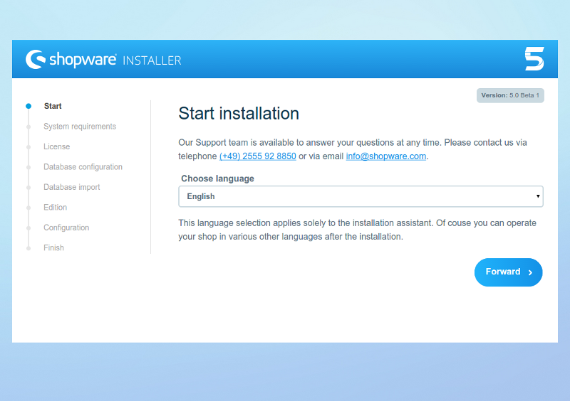
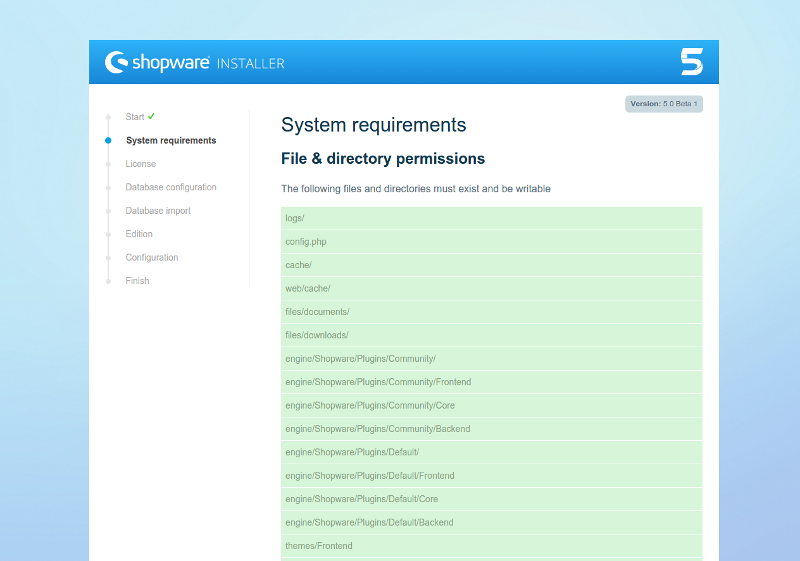
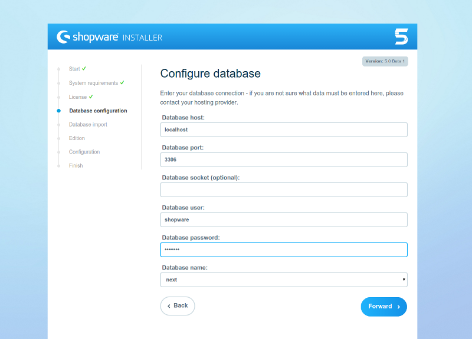
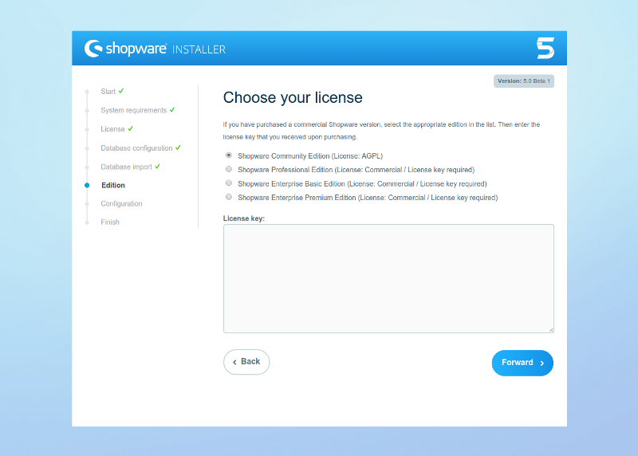
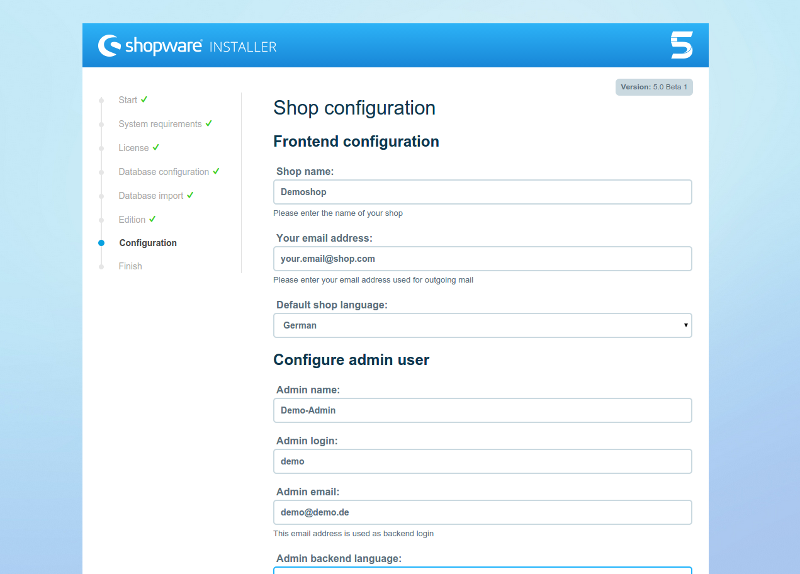
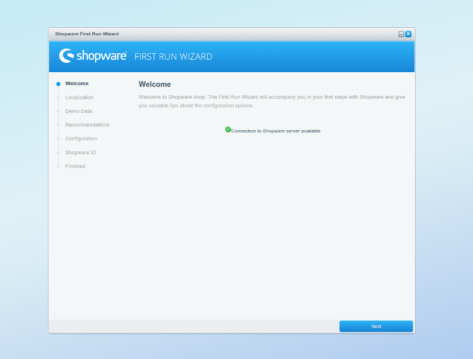
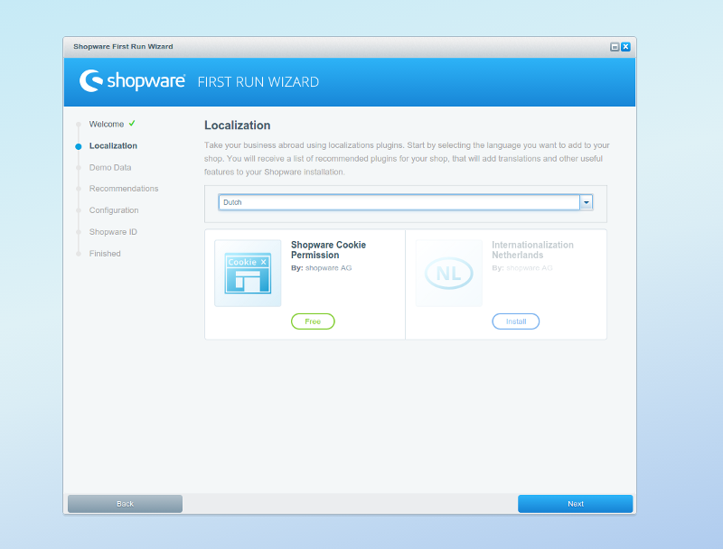
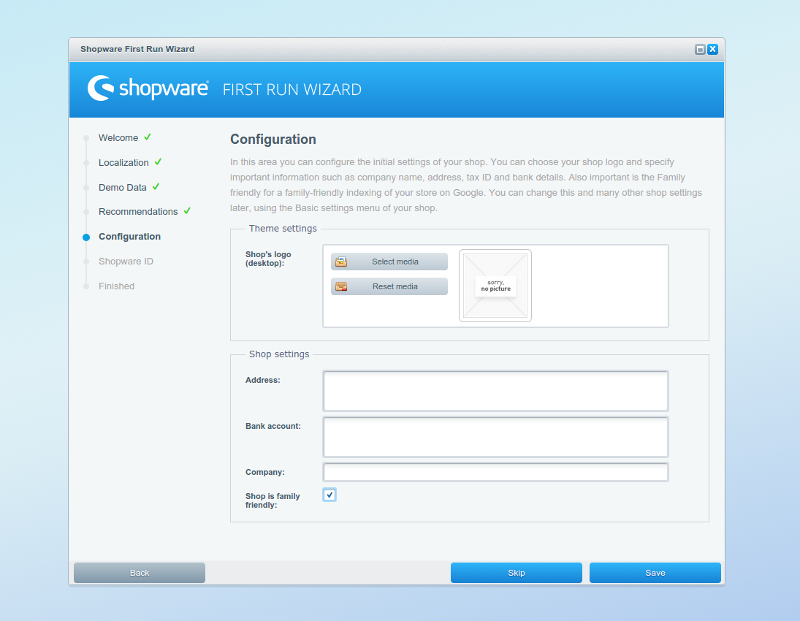
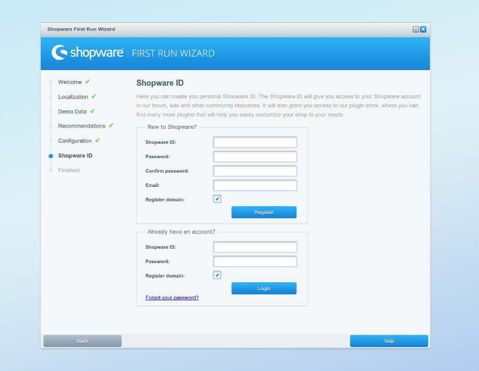

# Shopware 5 Installation Guide

## Shopware 5 Installer

Shopware 5 features a redesigned installer. If you have used the Shopware 4 installer, you will find the new version features a familiar workflow, while improving the previous experience.

In the welcome step, you can choose the language you wish to use during the installation process. On a later step, you will be able to configure the shop's language.

The installer will automatically check your system configuration to determine if it meets all of Shopware's requirements and recommendations.

After accepting Shopware's license, you will be asked to provide your database's access details. You should have previously created an empty database.

After the database has been successfully created, you can select which license you will be using with your Shopware installation. If unsure, use the default value.

In the last step of the installer you will be asked to configure your default shop and user account.

## Shopware 5 First Run Wizard

Shopware 5 includes a new First Run Wizard, that will assist you in installing new plugins and translations, and doing additional basic adjustments to your shop settings. The First Run Wizard can be skipped at any moment, and can be re-enabled after the first execution in the Basic Settings.

The first step welcomes you to your Shopware installation and checks connectivity to shopware's servers, required to provide plugin suggestions. No information about you or your shop is transmitted during this process.

During the following steps, you will be able to install and activate several plugins that will help you localize your shop for other markets. You will also have access to demo data sets, as well as plugins suggested by shopware.

The First Run Wizard also allows you to configure additional details about your shop, like your address or the shop's logo. You can change these values later, in the backend's Basic Settings or Theme Manager.

You can also login or register your Shopware ID, required to have access to the complete Shopware plugin catalogue. You can also automatically register your shop's domains and associate it to your Shopware ID.

Once you finish the last step of the First Run Wizard, you will be taken to your shop's backend, and have access to all of Shopware's features.
